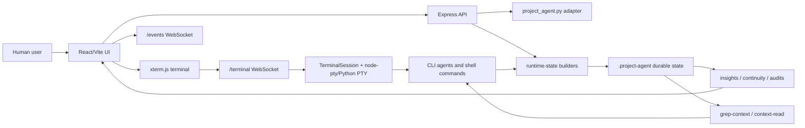

# CLI Memo 当前架构与功能说明

日期：2026-06-06

## 1. 产品定位

CLI Memo 现在不是单纯的 terminal wrapper，也不是单纯的 agent memory。它更接近一个本地 AI agent control plane：

- 左侧提供真实 terminal，让 Codex、Claude、Kimi、Gemini 或其他 CLI agent 在项目目录里运行。
- 右侧提供项目状态仪表台，让人先看到当前目标、当前进度、下一步、风险和接手状态。
- `.project-agent/` 保存可恢复、可审计、可检索的项目状态，让下一位 agent 不依赖上一段聊天记录也能接手。

核心原则是 summary-first + budgets + refs + on-demand reads。默认不把完整上下文塞给模型，而是先给一个小接手包，再通过 grep-first retrieval 和 source refs 按需读取细节。

## 2. 总体架构



### 2.1 前端层

主要文件：

- `src/App.jsx`
- `src/styles.css`
- `src/main.jsx`

前端负责三个界面面向：

- Terminal：真实命令输入输出，xterm.js 渲染，支持 CLI agent 启动。
- AI State Panel：目标、状态、下一步、风险、接手状态、内存图、流程、架构、handoff。
- Human Handoff Brief：右侧 handoff 默认先给人读的短摘要，高级 agent-readable packet 收进折叠区。

关键点：

- terminal 输入会清洗 bracketed paste 标记，避免 `[200~` / `[201~` 被当成命令。
- 本地 Vite 页面会让 `/terminal` 和 `/events` WebSocket 直连后端 `4147`，减少 Vite ws proxy 的不稳定感。
- 如果浏览器缓存了旧 goal id，前端会在加载新 state 后自动切回当前 active goal。

### 2.2 后端 API 层

主要文件：

- `server/index.js`
- `server/project-agent.js`
- `server/terminal-session.js`
- `server/runtime-state.js`
- `server/insights.js`

后端提供：

- HTTP API：`/api/state`、`/api/kernel`、`/api/insights`、`/api/events`、`/api/takeover-summary`、`/api/context-search`、`/api/context-read` 等。
- WebSocket：`/terminal` 负责 terminal I/O，`/events` 负责实时状态刷新。
- Project Agent CLI adapter：通过 `project_agent.py` 维护 goal、action、gate、evidence、audit、handoff。
- Runtime builders：把 state、runtime events、architecture、terminal snapshot 组合成 continuity、bundle、audit 和 UI insights。

关键点：

- `/api/kernel` 和 `/api/insights` 收到不存在的 goal 参数时，会降级到当前 active goal，避免 demo reset 后服务被旧 URL 打崩。
- `/api/evidence/last-command` 会对 terminal output 做二次清洗，避免控制序列进入证据。
- architecture watcher 会忽略 `.project-agent` 内部生成文件，避免治理文件反复污染真实项目变更。

### 2.3 Terminal 执行层

主要文件：

- `server/terminal-session.js`
- `server/python-pty-bridge.py`

职责：

- 优先使用 `node-pty` 提供真实 TTY。
- 当 `node-pty` 在本机不可用时，fallback 到 Python PTY bridge。
- 支持 `codex --version` 这类 CLI 命令在产品 terminal 中正常执行。
- 捕获最近一次命令、输出、开始/完成事件，并写入 runtime state。

已经验证：

- browser terminal 和 WebSocket terminal 都能清洗 bracketed paste。
- `codex --version` 可在产品 terminal 通道中输出 `codex-cli 0.137.0`。

### 2.4 Durable State 层

核心目录：

- `.project-agent/`

关键文件：

- `state.json`：Project Agent 原始目标、行动、证据、风险、审计状态。
- `runtime.json`：实时事件、hook ingress、agent heartbeat、terminal command events。
- `takeover-summary.json`：默认冷启动接手包，小而可读。
- `agent-context-bundle.json`：预算化索引，按 memory/process/architecture/handoff 分区。
- `continuity.json`：lean continuity manifest，保存摘要、refs、hash、预算和读取顺序。
- `continuity-detail.json`：rich audit/detail，按需读取。
- `memory-graph.json`：项目记忆图谱，带 provenance。
- `process-trace.json`：previous/current/next 流程游标。
- `development-trail.json`：流程事件与文件、文件夹、风险的连接。
- `architecture-map.json`：项目树、文件列表、recent changes、inspect order。
- `state-manifest.json`：handoff 文件 hash 清单。
- `continuity-contract.json`：agent-neutral 接手契约。
- `agent-runbook.json`：下一位 agent 的执行步骤和 proof gates。
- `takeover-acceptance-audit.json`：用户目标是否被 durable state 覆盖的审计。
- `next-agent-prompt.md`、`resume.md`、`recovery.md`：给下一位 agent 或人类的启动材料。

### 2.5 检索层

主要文件：

- `server/grep-context.js`
- `server/grep-context-cli.js`

当前方向是 grep-first retrieval。它不是传统向量 RAG，而是本地、确定性、refs-first 的检索层：

- 先用关键词、目标、当前任务在项目文本和 `.project-agent` 中找命中。
- 返回 snippet、path、line range、score 和 source ref。
- agent 再按 ref 精确读取，而不是一次性读完整 bundle。

使用方式：

```bash
npm run grep-context -- --project-dir demo-project --query "terminal handoff grep-first" --limit 8
npm run grep-context -- --project-dir demo-project --read ".project-agent/process-trace.json:1-80" --max-bytes 6000
```

这个方向可以和 RAG 媲美的点在于：对代码库和治理文件来说，精确可追溯的 grep + refs 经常比模糊 embedding 更可控。未来可以在 grep-first 之上加 ranking、symbol index 或 embedding，但默认接手路径不依赖它们。

## 3. 当前能实现的功能

### 3.1 项目初始化与目标管理

可以：

- 初始化项目内核和 `.project-agent` 状态。
- 创建 goal 和 acceptance criteria。
- 添加 action、gate、risk、decision、evidence。
- 根据 evidence 和 gate 做 completion audit。

相关入口：

```bash
npm run dev
npm run event -- --project-dir demo-project --phase observe --status done --title "..."
npm run acceptance -- --project-dir demo-project --write --verify
```

### 3.2 真实 terminal 与 CLI agent 启动

可以：

- 在浏览器里打开真实 shell。
- 运行普通命令、测试命令、构建命令。
- 启动 Codex CLI 或其他 CLI agent。
- 捕获命令输出并转成 evidence。
- 记录 command started / command completed 到 process trace。

当前已修复：

- `stdin is not a terminal` 通过 PTY fallback 解决。
- bracketed paste 序列不会进入命令记录。

### 3.3 Summary-first 接手协议

可以：

- 生成小接手包 `.project-agent/takeover-summary.json`。
- 给出 active goal、current state、next step、risk、read order、token budget、source refs。
- 对大模块只保留 summary、hash、source ref、on-demand read command。
- 让下一位 agent 从小包开始，而不是读 20 万 token 的大包。

相关入口：

```bash
npm run context -- --project-dir demo-project --write --verify
npm run context -- --project-dir demo-project --write --full
```

### 3.4 人类可读仪表台

可以：

- 右侧默认显示 Goal / State / Next / Risk / Resume。
- Handoff 抽屉先显示人类 brief。
- 审计、provenance、temporal、state boundary、runtime eval 等高级内容进入折叠区。
- 用更自然的 label 替代 `pre_edit_risk`、`ready_with_warnings` 这类内部字段。

这解决的是 demo 体验问题：AI 可以读 dense packet，但人不能被迫读内部结构。

### 3.5 可见记忆与过程追踪

可以：

- 把项目记忆写成 durable memory graph。
- 把过程写成 previous/current/next trace。
- 把流程事件和文件、文件夹、架构影响连起来。
- 在 UI 里展示 memory、process、architecture、handoff。

这和原版 agent memory 的差异是：我们不只保存“记忆文本”，而是把目标、过程、证据、文件影响、接手协议都纳入可审计状态。

### 3.6 架构感知与变更监控

可以：

- 扫描项目文件树。
- 分类 docs、code、config、kernel 等文件。
- 生成 architecture map、recent changes、impacted folders、inspect order。
- 监听真实项目文件变更并生成 runtime events。

当前仍是文件级和轻量 code graph，不是完整 IDE 级 symbol graph。

### 3.7 Handoff、Resume 与 Recovery

可以：

- 生成 takeover packet。
- 生成 next-agent prompt。
- 生成 resume / recovery 文档。
- 生成 continuity audit 和 state manifest。
- 用 hash 验证 handoff 文件是否属于同一快照。

目标是 crash-proof handoff：上一位 agent 崩了，下一位 agent 仍能从 `.project-agent` 接手。

### 3.8 审计、可信度与治理

可以：

- State Boundary Audit：区分 raw events、durable sources、derived indexes、disclosure outputs。
- Git Freshness Audit：记录 HEAD、branch、dirty tree、untracked files、state-file changes。
- Temporal Provenance Audit：记录 fact 的 source refs、hash、observed time、validity window、stale source、contradiction。
- Takeover Acceptance Audit：检查用户目标是否被 durable state 覆盖。
- Continuity Audit：检查接手材料是否完整、可读、hash 一致。

这让系统不只是“记住”，还会告诉 agent 这份记忆是否可信。

### 3.9 Provider-neutral CLI agent 框架

可以：

- 通过 terminal 直接跑 Codex。
- 通过同一套 handoff summary、grep-first retrieval、refs、budget 交给其他 CLI agent。
- 生成 CLI agent bootstrap。

理论上 Codex、Claude、Kimi、Gemini 这类 CLI agent 都可以接入，因为核心协议是文件和 terminal，不绑定某一家模型 API。

相关入口：

```bash
npm run cli-agent -- --project-dir demo-project
npm run codex-smoke -- --project-dir demo-project --no-codex
```

## 4. 当前边界与限制

现在还不能把它理解成完整生产级平台：

- 没有多用户权限、登录、远程部署、安全沙箱。
- 不是完整数据库，主要是 file-backed state + grep-first index。
- 不是完整向量 RAG，目前默认检索是 grep-first。
- code graph 仍偏轻量，还没有深入到完整 symbol/call graph。
- UI 仍是本地 demo 形态，不是最终商业产品的信息架构。
- 不负责替模型做复杂 reasoning，只负责把项目上下文组织成可接手、可验证、可检索的状态。

## 5. 当前最重要的产品能力

一句话概括：

CLI Memo 现在能让一个 CLI agent 在真实 terminal 里工作，同时把它的目标、过程、证据、项目架构、记忆、风险和接手协议沉淀成 `.project-agent` durable state。下一位 agent 不需要读上一段聊天记录，可以先读小 summary，再用 grep-first refs 按需打开证据和细节。

## 6. 推荐下一步

优先级建议：

1. 继续压右侧人类阅读体验，把 AI packet 和人类仪表台彻底分层。
2. 把 grep-first retrieval 做成更像本地检索数据库的体验：ranking、filters、line refs、file-type scopes、recent-first。
3. 增强 code graph：import graph、symbol graph、test ownership、co-change files。
4. 给 Claude/Kimi/Gemini 做 provider-neutral CLI bootstrap 模板。
5. 把 dev server 稳定性产品化：启动状态、端口占用提示、前后端健康检查、自动重连提示。
